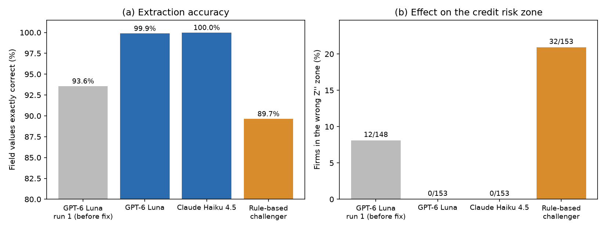
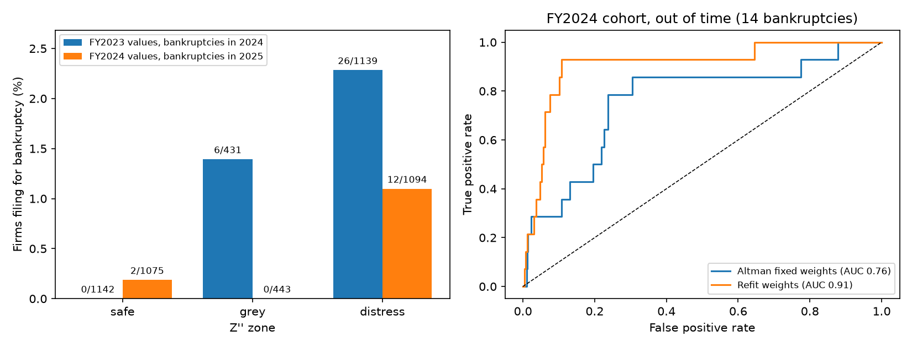

# Validating an LLM That Extracts Credit Risk Inputs from 10-K Filings

Can a large language model (LLM) read a company's annual report accurately enough to feed a credit risk score, and does that score predict failure? This project answers both questions for U.S. public companies, using the companies' own SEC filings as the answer key.

**Results.** Two LLMs from different providers extracted the six inputs of the Altman Z''-score from 153 annual reports. With the right text in hand, both matched the filed values almost perfectly (99.9% and 100%) and placed no firm in the wrong risk zone. A rule-based challenger reached 89.7% and left 32 firms out of their correct zone. The first run looked worse (12 of 148 firms could not be scored), but 54 of its 56 missing values were never in the text the model received. The weak point was the step that finds the financial statements, not the model. A backtest on about 2,600 firms per year shows Z'' ranks bankruptcy risk well (AUC 0.82 on the FY2023 cohort), and refitting its weights improved out-of-time ranking on FY2024 (AUC 0.76 to 0.91).

Full write-up: [validation report (PDF)](report/validation_report.pdf)



## Part 1: Validating the extraction

### What was tested

Each method reads the balance sheet and income statement from a company's FY2024 10-K and returns six numbers: total assets, current assets, current liabilities, retained earnings, total equity, and operating income. These feed the Altman Z''-score, which sorts firms into safe (above 2.60), grey (1.10–2.60), and distress (below 1.10) zones. These cutoffs are the ones commonly applied to Z'' without its constant term; the report explains which results depend on them.

The answer key is each company's XBRL data, the machine-readable numbers every public company files with the SEC alongside its 10-K. A value counts as correct only if it matches the filed value exactly, since printed numbers are exact.

Methods compared:

1. GPT-6 Luna (OpenAI), via OpenRouter.
2. Claude Haiku 4.5 (Anthropic), via OpenRouter.
3. A rule-based challenger that finds each label and reads the number after it. Its general parsing problems were fixed once, then it was frozen, so it was not tuned to individual firms.

Validation tests:

1. Accuracy: share of values matching the filed value exactly.
2. Error types: missing, sign error, scale error (millions read as thousands), or wrong value.
3. Values not printed in the filing: whether each returned number appears anywhere in the text the model was given.
4. Stability: agreement across repeated runs of the same filing at the default temperature.
5. Prompt sensitivity: accuracy under three wordings of the same request.
6. Risk zone impact: share of firms whose zone changes when extracted values replace filed values.

### Results

| Method | Field accuracy | Firms not in correct zone | Cost per call |
|---|---|---|---|
| GPT-6 Luna, run 1 (before fix) | 93.6% | 12 of 148 | about $0.0007 |
| GPT-6 Luna | 99.9% | 0 of 153 | about $0.0007 |
| Claude Haiku 4.5 | 100% | 0 of 153 | about $0.018 |
| Rule-based challenger | 89.7% | 32 of 153 | none |

### Findings

- Retrieval drove almost all first-run failures. Fixing the statement search raised accuracy from 93.6% to 99.9%, scored every firm, and admitted 5 firms the bug had excluded.
- Neither LLM invented a number. Every value not printed in a filing was a sum of two printed lines. Three firms (INOD, CCC, PLBY) report a redeemable noncontrolling interest outside equity, and the prompt asked for total equity including noncontrolling interests, so the models combined the lines. The error lies in a field definition that does not fit this presentation.
- Prompt wording mattered for loss-making firms. Without the "(accumulated deficit)" hint, GPT-6 Luna returned no retained earnings value for 7 of the 75 firms with an accumulated deficit, 6 of them in the grey or distress zone. Claude Haiku returned all 75 correctly.
- Neither model was better on every test. On the 49 firms with repeated runs for both models, GPT-6 Luna varied on 0 of 294 values and Claude Haiku on 2. Claude Haiku was more accurate on the main prompt and cost about 26 times more per call.
- The rule-based challenger failed most on operating income and total equity, both items printed under several different labels. Of the 32 firms not in their correct zone, 31 were unscored because of missing values and 1 was placed in another zone. Another 21 firms kept their zone with a distorted score, from wrong values that nothing flags.
- A 0.5% tolerance would have hidden errors. Printed values are exact, so the test is exact.

Recommended controls: run at temperature 0; check that each returned value appears as a printed number in the filing; flag any missing value for review; define each field to match how filings present it, and return the printed line without combining lines.

## Part 2: Does Z'' predict bankruptcy?



Two cohorts were scored on their fiscal-year values and followed for the next calendar year: FY2023 values with bankruptcies filed in 2024, and FY2024 values with bankruptcies filed in 2025. A bankruptcy is an 8-K reporting Item 1.03 (Bankruptcy or Receivership). The population covers 10-K filers with every Z'' input and at least $50M in assets, excluding financial firms.

| Cohort | Firms | Bankruptcies | AUC, Altman weights (95% interval) |
|---|---|---|---|
| FY2023 | 2,712 | 32 | 0.82 (0.75–0.88) |
| FY2024 | 2,612 | 14 | 0.76 (0.60–0.89) |

Out-of-time test: weights refit by logistic regression on FY2023 reached an AUC of 0.91 (0.81–0.96) on FY2024. A paired bootstrap puts the improvement at 0.15 (0.05–0.28), so it is unlikely to be chance, though the test year has only 14 bankruptcies.

- Bankruptcy rates rise from the safe zone to the distress zone in the FY2023 cohort (0%, 1.4%, 2.3%).
- The refit model puts most weight on operating income and working capital, and gives retained earnings a small positive coefficient, while Altman weights it heavily. Re-estimating old bankruptcy models on recent data has improved accuracy in earlier studies as well (Grice and Dugan, 2003).
- WW International shows the retained earnings problem. Its Z'' of 7.0 placed it in the safe zone, driven by retained earnings 3.5 times its assets, while it had negative equity and an operating loss of 43% of assets. It filed for bankruptcy the next year.

## Limitations

- Retained earnings can misstate a firm's current health: firms with large accumulated deficits score low, and a firm with large retained earnings can score safe while losing money (WW International).
- The extraction sample covers retail and software firms that print every input; 27 of 180 sampled firms were excluded (reasons in `data/processed/skipped.csv`).
- The backtest has few bankruptcies per year, uses a one-year horizon, and may miss bankruptcies not reported in an 8-K.
- Results cover two models at one point in time. A model update needs revalidation.

## Reproduce

```
python3 -m venv .venv && source .venv/bin/activate
pip install -r requirements.txt
export OPENROUTER_API_KEY=...        # and set SEC_USER_AGENT in config.py

python -m scripts.00_build_sample              # sample from SEC bulk data
python -m scripts.01_download                  # 10-Ks, statement excerpts, answer key
python -u -m scripts.02_extract MODEL_ID       # LLM calls (resumable)
python -m scripts.02b_rules                    # rule-based challenger
python -m scripts.03_evaluate MODEL_ID         # or: rules
python -m scripts.04_compare                   # all methods side by side
python -m scripts.05_backtest                  # Z'' vs. bankruptcies
python -m scripts.06_comparison_chart
python -m pytest tests
```
